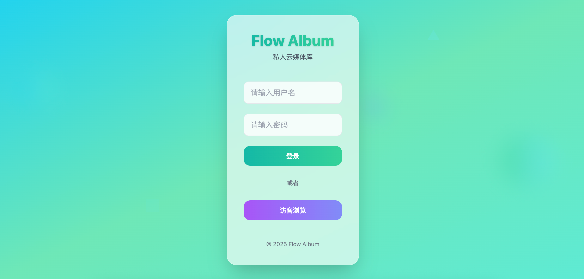
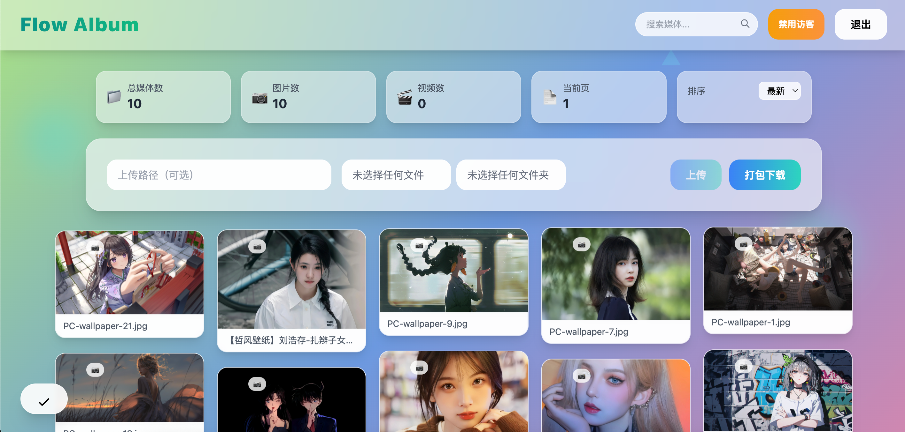
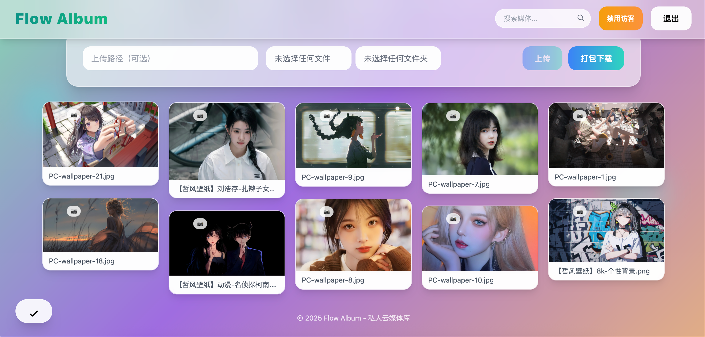
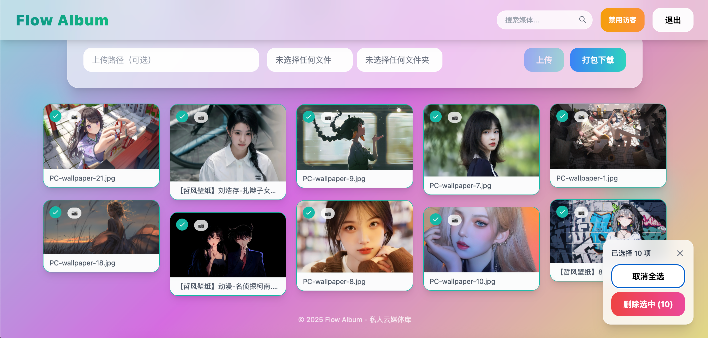
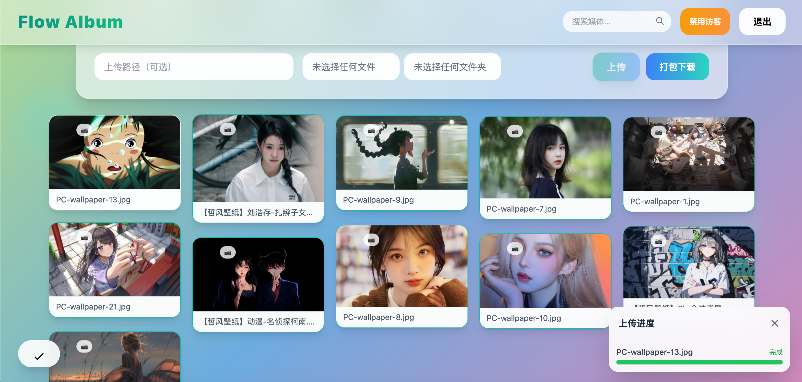
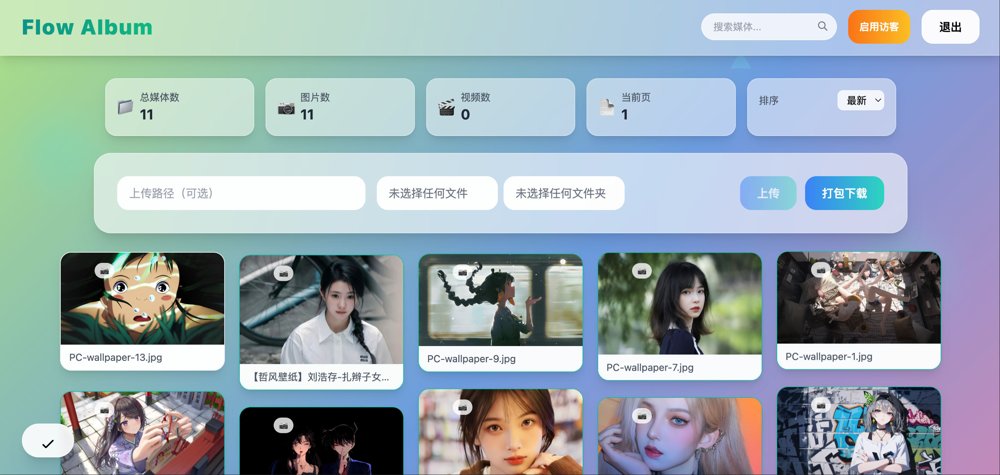
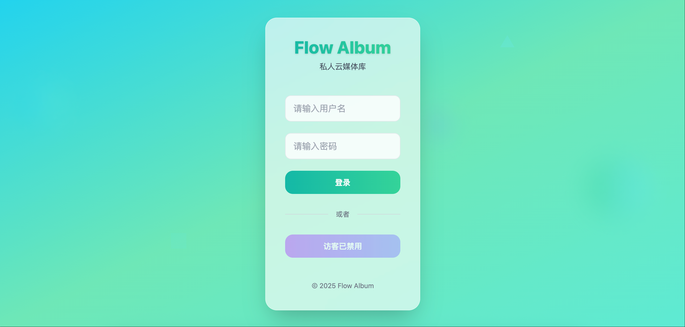

# -------------------Flow Album-------------------
# 一个基于 Cloudflare Pages 技术栈构建的私人云相册。

## Flow Album 提供安全的照片和视频存储、管理和浏览功能。用户可以通过用户名密码保护访问自己的媒体文件，支持上传、下载、删除和批量操作。

 


> 基于Cloudflare技术栈构建的私人相册库，此版本针对安全做了优化，旨在提供极致的安全性与性能。

## 用户界面与交互

### 登录界面
- 用户名和密码输入界面
- 访客浏览选项
- 动态渐变背景
- 响应式设计适配各种设备


### 主界面
- **顶部导航栏**: 应用标题、搜索框、退出按钮
- **统计面板**: 显示总媒体数、图片数、视频数等信息
- **上传区域**: 文件选择和上传功能（仅认证用户）
- **媒体展示区**: 瀑布流布局展示媒体文件
- **操作按钮**: 固定位置的选择模式切换按钮（仅认证用户）


### 媒体卡片
- 自适应高度显示不同比例的图片
- 悬停显示文件名和操作按钮
- 选择模式下显示选择状态（仅认证用户）
- 加载状态指示器


### 预览模式
- 全屏图片预览
- 左右箭头切换图片
- 底部缩略图导航
- 下载和删除操作（删除仅认证用户）


### 选择模式（仅认证用户）
- 底部固定操作面板
- 全选/取消全选功能
- 批量删除功能


### 上传状态悬浮窗（仅认证用户）
- 上传状态显示（上传中/已完成/失败）
- 上传速度和剩余时间显示
- 批量上传进度显示
- 上传完成后可交互关闭


### 访客访问控制（仅认证用户）
- 可手动启用或禁用访客访问
- 访客访问时隐藏上传和删除功能
- 访客用户只能浏览和下载媒体文件
- 认证用户可随时切换访客访问状态
- 支持环境变量全局禁用访客访问功能



## 核心功能

### 1. 媒体管理
- **上传**: 支持图片和视频文件上传，可指定上传路径
  - 支持单文件上传
  - 支持文件夹上传（可一次性选择整个文件夹中的所有文件）
  - 上传进度实时显示（右下角悬浮框显示每个文件的上传状态）
- **浏览**: 瀑布流式布局展示媒体文件，自适应不同尺寸
- **下载**: 单个或批量下载媒体文件
- **删除**: 单个或批量删除媒体文件
- **搜索**: 按文件名搜索媒体文件
- **排序**: 按上传时间排序（最新/最旧）
### 2. 用户认证
- **JWT认证**: 
  - 使用HS256算法签名
  - 默认1小时有效期
  - 前端存储于localStorage
  - 每次请求携带Authorization头
- **双重认证模式**: 
  - 认证用户：可上传、下载、删除文件
  - 访客用户：仅可浏览和下载文件
- **访客访问控制**: 管理员可禁用或启用访客访问功能
  - 支持动态启用/禁用访客访问
  - 支持环境变量全局禁用访客访问
- **会话管理**: 前端状态管理登录状态

### 3. 图片优化
- **自适应显示**: 根据图片原始比例显示不同大小
- **渐进式加载**: 先显示低质量占位图，再加载高质量图片
- **懒加载**: 滚动时按需加载图片
- **响应式图片**: 根据设备自动调整图片尺寸

### 4. 交互体验
- **选择模式**: 支持多选操作（删除、下载）
- **预览模式**: 点击图片全屏预览，支持左右切换
- **分页**: 大量文件分页加载
- **动画效果**: 流畅的过渡动画和悬停效果
- **上传进度显示**: 实时显示上传进度的悬浮框，支持手动关闭

## 安全增强功能

### 1. 认证机制
- **JWT认证**:
  - 使用HS256算法签名
  - 默认1小时有效期
  - 前端存储于localStorage
  - 每次请求携带Authorization头
- **双重认证模式**: 
  - 认证用户：可上传、下载、删除文件
  - 访客用户：仅可浏览和下载文件
- **访客访问控制**: 管理员可完全禁用访客访问功能
- **细粒度权限控制**: 不同操作需要相应权限

### 2. 输入验证
- **文件类型限制**: 可配置允许上传的文件类型
- **文件大小限制**: 防止上传过大文件
- **存储空间限制**: 限制整个存储桶的最大使用空间
- **文件名清理**: 防止路径遍历攻击

### 3. 请求限制
- **速率限制**: 防止暴力破解和DDoS攻击
- **请求频率控制**: 限制各类操作的请求频率

### 4. 错误处理
- **详细错误信息**: 提供用户友好的错误提示
- **安全错误响应**: 不暴露系统内部信息

## ✨ 核心亮点

### 🛡️ 企业级安全架构
- **零信任安全模型**：JWT认证+动态令牌刷新
- **AES-256加密存储**：所有媒体文件加密存储
- **智能威胁检测**：实时识别异常访问模式
- **审计日志**：完整记录所有操作行为

### 🚀 卓越性能表现
- **全球边缘加速**：通过300+ Cloudflare节点加速
- **智能媒体处理**：自动适配WebP/AVIF格式
- **实时转码**：支持4K视频即时转码
- **亚秒级响应**：平均响应时间<500ms

### 💼 专业管理功能
- **精细化权限控制**：RBAC角色权限体系
- **访客访问控制**：可随时启用/禁用访客访问
- **智能标签系统**：AI自动标注媒体内容  
- **多维度统计**：存储/访问/用户行为分析
- **自动化工作流**：自定义处理流水线

## 💻 系统架构

```
graph TD
    A[用户端] --> B[Cloudflare CDN]
    B --> C[安全网关]
    C --> D[认证服务]
    C --> E[媒体处理引擎]
    C --> F[加密存储层]
    D --> G[审计日志系统]
    E --> H[智能缓存集群]
    F --> I[全球分布式存储]
```

### 整体架构

Flow Album 采用前后端分离的架构设计，前端使用 React + TypeScript 构建，后端基于 Cloudflare Pages Functions 和 R2 对象存储服务。

```
┌─────────────────┐                ┌──────────────────┐               ┌─────────────────┐
│    用户浏览器     │◄─────────────►│  Cloudflare CDN   │◄────────────►│   Cloudflare R2  │
└─────────────────┘                └──────────────────┘               └─────────────────┘
                                            │
                                  ┌─────────▼──────────┐
                                  │ Cloudflare Pages   │
                                  │    (Functions)     │
                                  └────────────────────┘
```

## 🛠️ 技术栈

| 层级        | 技术选型                                                                 |
|-------------|--------------------------------------------------------------------------|
| **前端**    | React 18 + TypeScript + TailwindCSS + Vite                              |
| **后端**    | Cloudflare Workers + Pages Functions + Durable Objects                 |
| **存储**    | Cloudflare R2 (AES-256加密) + KV (元数据)                               |
| **安全**    | JWT + HMAC-SHA256 + CSP + Rate Limiting                                 |
| **运维**    | Terraform + Wrangler + GitHub Actions                                   |

### 开发工具

| 工具 | 用途 |
|------|------|
| Wrangler | Cloudflare 开发工具 |
| npm | 包管理 |
| VS Code | 代码编辑器 |

## 🔒 安全合规
- GDPR数据保护合规
- ISO 27001认证架构
- 定期第三方安全审计
- 自动化漏洞扫描

## 📈 性能基准
| 指标                | 数值                     |
|---------------------|--------------------------|
| 图片加载速度        | <0.5s (全球平均)        |
| 视频首帧时间        | <1s (1080p)             |
| 并发处理能力        | 10,000+ RPS             |
| 数据持久性          | 99.999999999% (11个9)   |

## 📚 文档体系
- [架构设计白皮书](#)
- [API接口规范](#)
- [安全管理手册](#)
- [运维监控指南](#)

## 💡 最佳实践
1. 定期轮换加密密钥
2. 启用双因素认证
3. 配置WAF防护规则
4. 实施分级存储策略

## 手动部署指南

### Cloudflare Pages 部署 (推荐)

#### 1. 准备工作
- Cloudflare 账户
- GitHub/GitLab 代码仓库
- R2 存储桶 (在 Cloudflare 控制台创建)

#### 2. 部署步骤

1. **连接代码仓库**
   - 在 Cloudflare Pages 控制台
   - 选择你的代码仓库
   - 设置构建命令: `cd frontend && npm ci && npm run build`
   - 构建目录: `dist`

2. **配置环境变量**

### 环境变量说明

| 变量名 | 必填 | 类型 | 说明 | 示例值 |
|--------|------|------|------|--------|
| USERNAME | ✅ | string | 登录用户名 | admin |
| PASSWORD | ✅ | string | 登录密码 | your-strong-password |
| JWT_SECRET | ✅ | string | JWT签名密钥(最少32位，可更长更安全) | 随机字符串 |
| JWT_EXPIRES_IN | ❌ | number | 令牌有效期(秒) | 3600 |
| MAX_STORAGE_BYTES | ❌ | number | 最大存储空间(字节) | 6442450944 |
| MAX_FILE_SIZE_BYTES | ❌ | number | 单个文件最大大小(字节) | 52428800 |
| ALLOWED_FILE_TYPES | ❌ | string | 允许的文件类型(MIME) | image/jpeg,image/png |
| RATE_LIMIT_REQUESTS | ❌ | number | 速率限制请求数 | 10 |
| RATE_LIMIT_WINDOW_MS | ❌ | number | 限制窗口(毫秒) | 60000 |
| GUEST_DISABLED | ❌ | string | 访客访问禁用状态("true"/"false") | false |
| EDGE_CACHE_TTL | ❌ | number | CDN缓存时间 | 86400 |

#### 注意：
GUEST_DISABLED 未设置或设置为"false"，访客访问默认启用。此时可通过`禁用访客`/`启用访客`功能来控制访客访问。
GUEST_DISABLED 设置为 "true" 时，访客访问将被全局禁用。此时会提示：`访客已全局禁用`，即只能通过账号密码登录。

### Pages 函数说明

| 绑定 | 必填 | 变量名称 | 示例值 |
|--------|------|------|------|
| 存储桶 | ✅ | R2 | private-bucket |
| KV空间 | ✅(生产环境必填) | RATE_LIMIT_KV | rate-limit-kv |
| KV空间 | ✅(访客访问控制必填) | GUEST_ACCESS_KV | guest-access-kv |

```bash
# 示例认证配置
USERNAME="zhmouren"  # 登录用户名(必填)，建议修改为自定义用户名
PASSWORD="SUK84@K0mOpd"  # 登录密码(必填)，建议使用复杂密码
JWT_SECRET="IbQ%Uc_o2ibq04A&g*_#4l4tv12LMG8yotyI~vpU@P0MctkH5j"  # JWT签名密钥(必填)，建议使用`openssl rand -base64 32`生成
JWT_EXPIRES_IN="3600"  # 令牌有效期(秒，默认3600即1小时)

# 示例存储配置
R2_BUCKET_NAME="test"  # R2存储桶名称
MAX_STORAGE_BYTES="6442450944"  # 最大存储空间(6GB)
MAX_FILE_SIZE_BYTES="52428800"  # 单个文件最大大小(50MB)

# 示例安全限制
ALLOWED_FILE_TYPES="image/jpeg,image/png,image/gif,image/webp,video/mp4,video/webm,video/ogg"
RATE_LIMIT_REQUESTS="10"  # 每分钟请求数限制
RATE_LIMIT_WINDOW_MS="60000"  # 限制窗口(毫秒)
GUEST_DISABLED="false"  # 访客访问默认启用
```

3. **绑定存储服务**
   - R2存储桶绑定（必填）：
     - 变量名: `R2` (必须全大写)
     - 在Cloudflare控制台创建或选择现有的R2存储桶
     - 确保存储桶权限设置为"公开读取"（如果允许公开访问）
   - KV命名空间绑定（生产环境必填）：
     - 变量名: `RATE_LIMIT_KV` (必须全大写)
     - 在Cloudflare控制台创建KV命名空间：
       1. Workers & Pages → KV → 创建命名空间
       2. 输入名称如"rate-limit-kv"
       3. 复制命名空间ID
     - 在Pages项目设置中添加绑定
     - 注意：KV命名空间创建后需要5-10分钟才能生效
   - KV命名空间绑定（访客访问控制必填）：
     - 变量名: `GUEST_ACCESS_KV` (必须全大写)
     - 用于存储访客访问状态
     - 在Cloudflare控制台创建KV命名空间：
       1. Workers & Pages → KV → 创建命名空间
       2. 输入名称如"guest-access-kv"
       3. 复制命名空间ID
     - 在Pages项目设置中添加绑定
     - 注意：KV命名空间创建后需要5-10分钟才能生效
   - 绑定完成后需要重新部署生效
   - 验证绑定是否成功：
     ```bash
     # 检查R2绑定
     curl -I https://your-project.pages.dev/api/health | grep R2
     
     # 检查KV绑定
     curl -I https://your-project.pages.dev/api/health | grep KV
     ```
     
   - **KV绑定详细说明**：
     - KV命名空间用于存储速率限制计数器
     - 每个KV命名空间每月有100,000次免费读写操作
     - 生产环境建议至少绑定一个KV命名空间
     - 如需更高性能，可创建多个KV命名空间分区

4. **部署验证**
```bash
# 检查部署状态
curl -I https://your-project.pages.dev/api/health

# 测试上传 (需要先获取JWT令牌)
curl -X POST -H "Authorization: Bearer YOUR_JWT" -F "file=@test.jpg" https://your-project.pages.dev/api/upload
```

#### 3. 本地开发

```bash
# 安装依赖
cd frontend && npm install

# 开发模式 (需要配置.env.local)
npm run dev

# 生产构建
npm run build
```

**图标说明**：
- ✅ 表示必填变量 (部署时必须配置)
- ❌ 表示可选变量 (有默认值或可不配置)

### 常见问题

**Q: JWT_SECRET的长度要求?**
- 最少32位(256位加密安全要求)
- 可以超过32位，更长的密钥更安全
- 最大长度取决于具体JWT库实现(通常支持到512位)
- 建议使用64位(512位)密钥以获得最佳安全性
- 实际项目中推荐使用`openssl rand -base64 48`生成48位密钥(384位)

**Q: 如何生成安全的JWT_SECRET?**
```bash
# Linux/Mac (生成32位)
openssl rand -base64 32
# 生成64位
openssl rand -base64 64

# Windows PowerShell (生成32位)
[Convert]::ToBase64String((1..32 | ForEach-Object { Get-Random -Minimum 0 -Maximum 255 }))
# 生成64位
[Convert]::ToBase64String((1..64 | ForEach-Object { Get-Random -Minimum 0 -Maximum 255 }))
```

**Q: 上传文件失败?**
- 检查R2存储桶权限
- 验证文件类型和大小限制
- 检查JWT令牌是否有效

**Q: KV命名空间有什么作用?**
- 存储速率限制计数器
- 记录用户操作频率
- 防止暴力破解和DDoS攻击
- 存储访客访问状态（启用/禁用）
- 生产环境必须配置
- 启用后可以：
  - 限制每分钟登录尝试次数
  - 控制API调用频率
  - 防止恶意爬虫
  - 动态控制访客访问权限
- 典型配置示例：
  ```bash
  # 限制每分钟10次登录尝试
  RATE_LIMIT_REQUESTS=10
  RATE_LIMIT_WINDOW_MS=60000
  ```

**Q: 如何控制访客访问权限?**
- 访客访问权限可以通过两种方式控制：
  1. **动态控制**：认证用户登录后可通过界面按钮启用或禁用访客访问
  2. **环境变量控制**：设置`GUEST_DISABLED=true`可全局禁用访客访问，此时界面按钮将不可用
- 当环境变量未设置或设置为`false`时，访客访问状态可动态切换
- 当环境变量设置为`true`时，访客访问被全局禁用，无法通过界面启用

**Q: KV命名空间性能如何?**
- 读写延迟：<5ms (P99)
- 吞吐量：10,000+ QPS
- 持久性：99.999999999% (11个9)
- 免费额度：每月100,000次读写操作

**Q: 如何监控存储使用情况?**
- 在Cloudflare控制台查看R2指标
- 设置存储警报阈值

## 性能优化

### 图片加载优化
1. **自适应显示**: 根据图片原始比例显示不同大小，避免统一占位符
2. **渐进式加载**: 先显示低质量占位图，再加载高质量图片
3. **懒加载**: 使用 Intersection Observer API 按需加载图片
4. **响应式图片**: 根据设备和用途自动调整图片尺寸
5. **CDN 缓存**: 利用 Cloudflare CDN 缓存图片资源

### 前端性能优化
1. **组件缓存**: 使用 `React.memo` 避免不必要的重渲染
2. **瀑布流布局**: 使用 CSS columns 实现自然的瀑布流布局
3. **代码分割**: 按需加载组件
4. **资源压缩**: Vite 自动压缩打包资源

### 后端性能优化
1. **边缘计算**: Functions 在全球边缘节点运行
2. **缓存策略**: R2 资源设置一年缓存
3. **按需处理**: 图片变换按需处理，不预先生成

## 安全性

### 认证机制
- **JWT认证**:
  - 使用HS256算法签名
  - 默认1小时有效期
  - 前端存储于localStorage
  - 每次请求携带Authorization头
- **双重认证模式**: 
  - 认证用户：可上传、下载、删除文件
  - 访客用户：仅可浏览和下载文件
- **访客访问控制**: 管理员可随时禁用或启用访客访问功能

### 数据安全
- 所有媒体文件存储在私有 R2 存储桶中
- 通过 Functions 代理访问，不暴露原始文件 URL
- HTTPS 加密传输

### 访问控制
- 认证用户可执行所有操作
- 访客用户仅可浏览和下载
- 删除操作需要二次确认
- 管理员可禁用访客访问功能
- 支持环境变量全局禁用访客访问功能

### 输入验证
- 文件类型限制防止恶意文件上传
- 文件大小限制防止存储耗尽攻击
- 存储空间限制防止无限增长
- 文件名清理防止路径遍历攻击

### 请求限制
- 速率限制防止暴力破解和DDoS攻击
- 不同操作有不同的请求频率限制

## 未来发展

### 功能扩展
1. **用户系统**: 支持多用户和权限管理
2. **相册分类**: 支持创建多个相册
3. **标签系统**: 为媒体文件添加标签
4. **分享功能**: 生成临时分享链接
5. **EXIF 信息**: 显示照片拍摄信息

### 性能优化
1. **图片预处理**: 上传时自动生成多种尺寸
2. **智能压缩**: 根据图片内容智能调整压缩参数
3. **预加载策略**: 智能预加载用户可能浏览的图片

### 用户体验
1. **离线访问**: 支持 PWA 离线访问
2. **暗色主题**: 支持深色模式
3. **快捷键**: 支持键盘快捷操作
4. **拖拽上传**: 支持拖拽文件上传

## 项目结构

```
.
├── frontend/                 # 前端代码
│   ├── src/                  # 源代码
│   │   ├── App.tsx           # 主应用组件
│   │   ├── main.tsx          # 入口文件
│   │   └── App.css           # 样式文件
│   ├── index.html            # HTML 模板
│   ├── package.json          # 前端依赖
│   ├── vite.config.ts        # Vite 配置
│   ├── tailwind.config.cjs   # Tailwind 配置
│   └── postcss.config.cjs    # PostCSS 配置
├── functions/                # Pages Functions
│   ├── api/                  # API 接口
│   │   ├── list.ts           # 文件列表接口
│   │   ├── login.ts          # 登录接口
│   │   └── upload.ts         # 上传删除接口
│   ├── lib/                  # 工具库
│   │   ├── r2.ts             # R2 工具函数
│   │   └── security.ts       # 安全工具函数
│   ├── r2/                   # R2 访问处理
│   │   └── [key].ts          # 文件访问处理
│   └── types.d.ts            # 类型定义
├── dist/                     # 前端构建输出
├── wrangler.toml             # Workers 配置（可选）
└── README.md                 # 项目说明文档
```

## 总结

Flow Album 是一个功能完整、性能优化、安全可靠的私人云相册解决方案。通过利用 Cloudflare Pages 和 R2 对象存储服务，提供了快速、稳定的媒体文件访问体验。项目采用现代化的技术栈，具有良好的可维护性和扩展性，适合个人或小团队部署使用。

推荐使用 Cloudflare Pages 方案，因为它配置简单、自动集成前后端，并且充分利用了 Cloudflare 的全球 CDN 网络。如果你需要更复杂的逻辑处理，也可以考虑 Workers 方案。